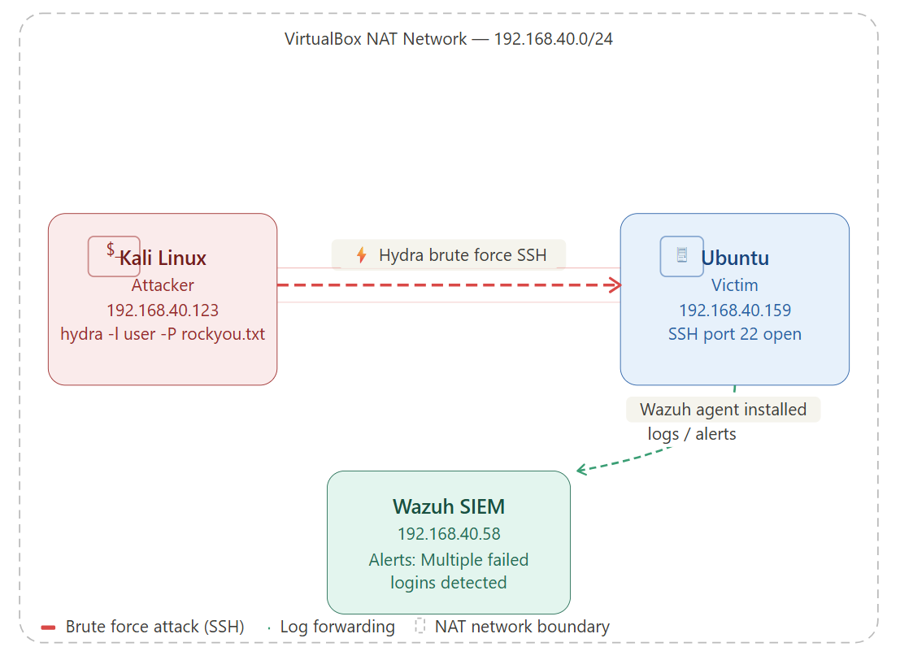
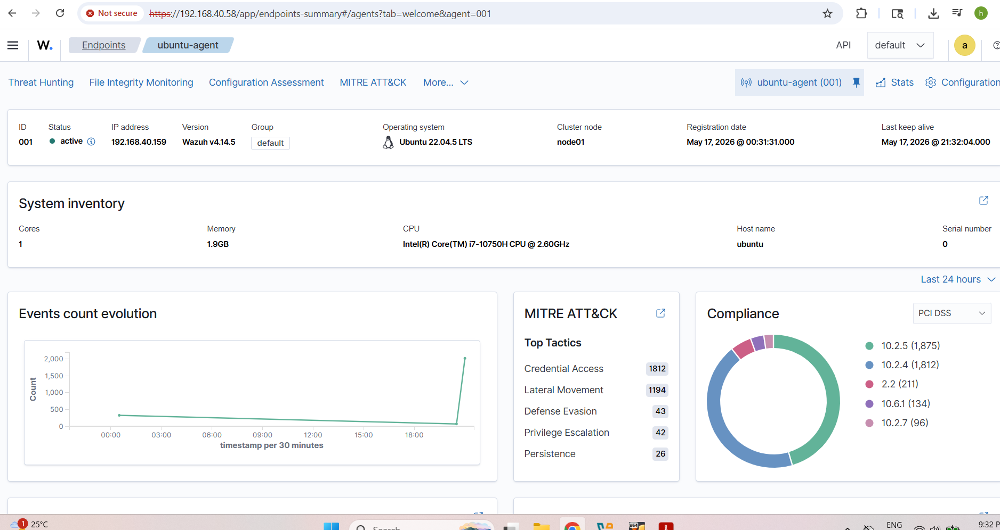
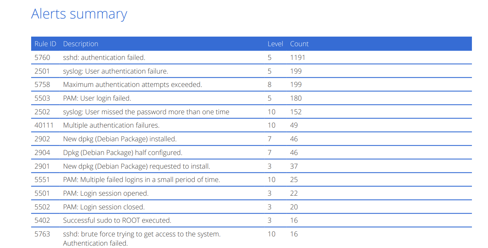
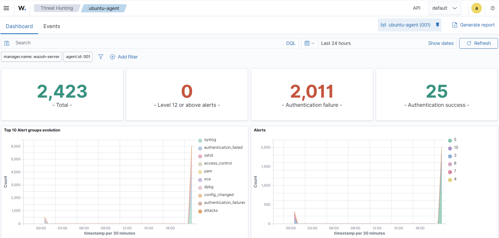

# 🛡️ Home SOC Lab: Brute Force Detection with Wazuh SIEM

A home cybersecurity lab simulating a real-world SSH brute force attack using Hydra from Kali Linux, detected in real time by a Wazuh SIEM — built entirely on free, open-source tools.

---

## 📌 Overview

This project demonstrates hands-on blue team skills: deploying a SIEM, onboarding a monitored endpoint, simulating an attack, and analyzing the resulting alerts. All machines run locally inside VirtualBox.

| Goal | Details |
|------|---------|
| **Simulate** | SSH brute force attack using Hydra |
| **Detect** | Real-time alerting via Wazuh SIEM |
| **Enrich** | Deep log visibility with Sysmon-equivalent (auditd) |
| **Analyze** | Trace attacker IP, username, and timestamps in Wazuh dashboard |

---

## 🖥️ Lab Architecture

```
┌─────────────────────────────────────────────────────┐
│              VirtualBox NAT Network                  │
│                  192.168.40.0/24                     │
│                                                      │
│  ┌─────────────────┐       ┌──────────────────────┐  │
│  │   Kali Linux    │──────▶│   Ubuntu (Victim)    │  │
│  │  192.168.40.123 │ SSH   │   192.168.40.159     │  │
│  │  Hydra attack   │ :22   │   Wazuh Agent        │  │
│  └─────────────────┘       └──────────┬───────────┘  │
│                                       │ logs          │
│                            ┌──────────▼───────────┐  │
│                            │    Wazuh SIEM        │  │
│                            │   192.168.40.58      │  │
│                            │   Dashboard + Alerts │  │
│                            └──────────────────────┘  │
└─────────────────────────────────────────────────────┘
```


*Figure: Lab network — Kali attacker, Ubuntu victim, and Wazuh SIEM on VirtualBox NAT network*

---

## 🧰 Tools & Technologies

| Tool | Role | Version |
|------|------|---------|
| [VirtualBox](https://www.virtualbox.org/) | Hypervisor | Latest |
| [Wazuh](https://wazuh.com/) | SIEM / Log Analysis | 4.x OVA |
| [Ubuntu Server](https://ubuntu.com/server) | Victim endpoint | 22.04 LTS |
| [Kali Linux](https://www.kali.org/) | Attacker machine | Latest |
| [Hydra](https://github.com/vanhauser-thc/thc-hydra) | Brute force tool | Built-in on Kali |
| [auditd](https://linux.die.net/man/8/auditd) | System call logging | Built-in on Ubuntu |

---

## ⚙️ Lab Setup

### Phase 1 — Requirements

- Computer with **16GB RAM minimum** (32GB recommended)
- **100GB free SSD space**
- VirtualBox installed

### Phase 2 — Deploy Wazuh SIEM

1. Download the [Wazuh OVA](https://wazuh.com/install/) (pre-configured appliance)
2. In VirtualBox: **File → Import Appliance** → select the OVA
3. Set network adapter to **NAT Network** (shared with other VMs)
4. Start the VM and log in: `admin / admin`
5. Note the IP address:
```bash
ip a
# e.g. 192.168.40.58
```

### Phase 3 — Set Up Ubuntu Victim

1. Create a new VM using Ubuntu Server ISO
2. Set the same **NAT Network** as Wazuh
3. Install and enable SSH:
```bash
sudo apt update && sudo apt install openssh-server -y
sudo systemctl enable ssh && sudo systemctl start ssh
```
4. Navigate to `https://192.168.40.58` from the Ubuntu VM
5. In the Wazuh dashboard: **Add Agent → Linux → copy the install command**
6. Run the command on Ubuntu and start the agent:
```bash
sudo systemctl enable wazuh-agent && sudo systemctl start wazuh-agent
```
7. Verify: the Wazuh dashboard should show **1 Active Agent**

### Phase 4 — Enrich Logs with auditd

Standard Linux logs miss key attacker actions. Enrich them:

```bash
sudo apt install auditd -y
sudo systemctl enable auditd && sudo systemctl start auditd

# Watch for failed login attempts
sudo auditctl -w /var/log/auth.log -p rwxa -k auth_log
```

Then update the Wazuh agent config to ingest auth logs:

```xml
<!-- /var/ossec/etc/ossec.conf on Ubuntu -->
<localfile>
  <log_format>syslog</log_format>
  <location>/var/log/auth.log</location>
</localfile>
```

```bash
sudo systemctl restart wazuh-agent
```

---

## ⚡ Attack Simulation

### Step 1 — Launch Hydra from Kali

```bash
hydra -l ubuntu -P /usr/share/wordlists/rockyou.txt ssh://192.168.40.159 -t 4 -V
```

| Flag | Meaning |
|------|---------|
| `-l ubuntu` | Target username |
| `-P rockyou.txt` | Password wordlist |
| `ssh://192.168.40.159` | Target protocol and IP |
| `-t 4` | 4 parallel threads |
| `-V` | Verbose (show each attempt) |

### Step 2 — Observe in Wazuh Dashboard

Navigate to: **Wazuh Dashboard → Security Events → Search: "authentication failure"**

You will see a flood of **Level 10 alerts** similar to:

```
Rule ID   : 5710
Level     : 10
Rule Desc : Multiple authentication failures
Source IP : 192.168.40.123
User      : ubuntu
Location  : /var/log/auth.log
```

---

## 📊 Results

### Wazuh Dashboard


*Figure: Wazuh SIEM dashboard showing agent status and security event overview*

### Security Alerts — Brute Force Detected


*Figure: Flood of Level 10 authentication failure alerts triggered by Hydra from 192.168.40.123*

### Threat Hunting View


*Figure: Threat hunting panel showing attacker IP, targeted username, and timestamps*

### Key Findings

- Hydra generated **hundreds of failed SSH login attempts** within seconds
- Wazuh detected and alerted on the brute force pattern in **real time**
- The attacker's IP (`192.168.40.123`) and targeted account were clearly visible in the log detail
- Alert level escalated to **Level 10** after the threshold of failures was crossed

---

## 🧠 Skills Demonstrated

- SIEM deployment and configuration (Wazuh)
- Linux endpoint hardening and agent onboarding
- Log ingestion and enrichment (auditd, auth.log)
- Offensive tooling simulation (Hydra)
- Alert triage and log analysis
- Network segmentation with VirtualBox NAT

---

## 🚀 Future Improvements

- [ ] Add **active response** rule to automatically block the attacker's IP via `iptables`
- [ ] Simulate **Windows RDP brute force** and add a Windows 10 VM
- [ ] Integrate **Shuffle SOAR** for automated alert-to-ticket workflows
- [ ] Add **Elastic Stack** for advanced log visualisation and dashboards
- [ ] Write custom Wazuh rules for detecting credential stuffing patterns

---

## 📁 Repository Structure

```
├── README.md
└── screenshots/
    ├── network-diagram.png
    ├── wazuh-alert.png
    ├── wazuh-dash.png
    └── wazuh-threat-hunting.png
```

---

## 🛡️ Phase 2 — Attack Prevention

Building on the detection lab, this phase implements a **production-grade prevention stack** that stops brute force attacks across all ports — not just SSH. This mirrors real-world blue team defensive controls used in enterprise environments.

---

### 🏗️ Prevention Architecture

```
Attack (Hydra / any tool, any port)
        │
        ▼
  SSH hardening → PasswordAuthentication disabled
  → Hydra exits immediately, zero attempts logged
        │
        ▼
  fail2ban watches auth logs → bans attacker IP
  across ALL ports after threshold is crossed
        │
        ▼
  Wazuh Active Response → iptables DROP rule
  applied automatically on rule trigger
        │
        ▼
  Custom Wazuh rule → Level 12 MITRE-tagged alert
  logged in dashboard for analyst review
```

---

### 🧰 Additional Tools

| Tool | Role |
|---|---|
| fail2ban | Log-based IP banning across all ports |
| iptables | Kernel-level packet filtering |
| OpenSSH hardening | Disable password auth, restrict users |
| Wazuh Active Response | Auto-block via firewall-drop command |

---

### ⚙️ Implementation Steps

#### Step 1 — SSH Hardening (Kill the attack surface)

Edit the SSH daemon config on the Ubuntu victim:

```bash
sudo nano /etc/ssh/sshd_config
```

Apply the following hardening directives:

```
PermitRootLogin no
PasswordAuthentication no
MaxAuthTries 3
LoginGraceTime 20
AllowUsers ubuntu
```

> ⚠️ Set up SSH key-based authentication **before** disabling password auth or you will lock yourself out.

Validate the config and restart:

```bash
sudo sshd -t          # must return no output (no errors)
sudo systemctl restart ssh
sudo systemctl status ssh
```

**Why this matters:** Disabling `PasswordAuthentication` makes Hydra completely useless — there is nothing to brute force. The tool will exit within seconds with an error.

---

#### Step 2 — Install and Configure fail2ban (All-port IP banning)

```bash
sudo apt install fail2ban -y
```

Create a local jail config (never edit the default `jail.conf`):

```bash
sudo nano /etc/fail2ban/jail.local
```

```ini
[DEFAULT]
bantime = 1h
findtime = 5m
maxretry = 5
banaction = iptables-multiport

[sshd]
enabled = true
port = ssh
logpath = /var/log/auth.log
backend = systemd
```

> **`iptables-multiport`** is the key setting — it blocks the attacker's IP across **all ports**, not just the one being attacked.

Start and verify:

```bash
sudo systemctl enable fail2ban
sudo systemctl start fail2ban
sudo fail2ban-client status sshd
```

Expected output shows `Currently banned: 0` — fail2ban is live and watching.

---

#### Step 3 — Wazuh Active Response (Automated SIEM-driven blocking)

On the **Wazuh Manager**, edit the main config:

```bash
sudo nano /var/ossec/etc/ossec.conf
```

Add inside the `<ossec_config>` block:

```xml
<active-response>
  <command>firewall-drop</command>
  <location>local</location>
  <rules_id>5710</rules_id>
  <timeout>600</timeout>
</active-response>
```

| Field | Value | Meaning |
|---|---|---|
| `command` | `firewall-drop` | Built-in Wazuh script that calls iptables |
| `rules_id` | `5710` | Fires on multiple authentication failures |
| `timeout` | `600` | Blocks attacker IP for 10 minutes |

Restart the manager:

```bash
sudo systemctl restart wazuh-manager
```

---

#### Step 4 — Custom Wazuh Rule (MITRE ATT&CK tagged alert)

Standard Rule 5710 catches rapid brute force. This custom rule catches **sustained or slow attacks** that try to stay under the threshold:

On the Wazuh Manager, edit local rules:

```bash
sudo nano /var/ossec/etc/rules/local_rules.xml
```

```xml
<group name="custom_brute_force,">

  <rule id="100010" level="12" frequency="5" timeframe="120">
    <if_matched_sid>5710</if_matched_sid>
    <same_source_ip />
    <description>Sustained brute force: 5+ failures from same IP in 2 min</description>
    <mitre>
      <id>T1110</id>
    </mitre>
  </rule>

</group>
```

This fires a **Level 12 (Critical)** alert tagged with MITRE ATT&CK technique **T1110 — Brute Force**, visible in the Wazuh threat hunting dashboard.

---

### ⚡ Re-running the Attack (Prevention Proof)

With the prevention stack in place, re-run the original Hydra command from Kali:

```bash
hydra -l ubuntu -P /usr/share/wordlists/rockyou.txt ssh://192.168.40.159 -t 4 -V
```

**Expected result:**

```
[ERROR] target ssh://192.168.40.159:22/ does not support password authentication (method reply 4).
```

Hydra connects, asks the server if password auth is supported, receives a hard **NO**, and exits immediately — zero login attempts are made.

---

### 📊 Before vs After Comparison

| Metric | Before Prevention | After Prevention |
|---|---|---|
| Hydra runtime | Minutes (14M+ attempts queued) | ~2 seconds |
| Login attempts made | Hundreds per second | **Zero** |
| Wazuh alerts | Flood of Level 10 alerts | No alerts (nothing to detect) |
| fail2ban bans | N/A (not installed) | IP banned after 5 tries if password auth were on |
| Attack outcome | Runs indefinitely | Exits with error immediately |

> **Key insight:** This demonstrates the difference between **detection** (catching the attack mid-flight) and **prevention** (the attack never happens). The goal of a mature security posture is to reach prevention.

---

### 📸 Screenshots

| Screenshot | Description |
|---|---|
| `screenshots/fail2ban-status.png` | fail2ban active and watching sshd jail |
| `screenshots/ssh-hardening.png` | sshd_config with hardening directives applied |
| `screenshots/hydra-blocked.png` | Hydra exiting with password auth error — zero attempts |
| `screenshots/wazuh-active-response.png` | Wazuh active response config in ossec.conf |

> **Tip for your portfolio:** Place the Hydra "before" screenshot (flooding alerts) next to the "after" screenshot (instant error) side by side. That contrast tells the whole story at a glance.

---

### 🧠 Additional Skills Demonstrated

- SSH daemon hardening (CIS Benchmark aligned)
- fail2ban deployment and jail configuration
- iptables-based multi-port IP blocking
- Wazuh Active Response configuration
- Custom SIEM rule writing with MITRE ATT&CK mapping
- Security control validation through adversary simulation

---

### 🚀 Updated Future Improvements

- [x] ~~Add active response rule to automatically block attacker IP~~ ✅ Done
- [ ] Simulate Windows RDP brute force with a Windows 10 VM
- [ ] Integrate Shuffle SOAR for automated alert-to-ticket workflows
- [ ] Add Elastic Stack for advanced log visualisation
- [ ] Write custom Wazuh rules for credential stuffing patterns
- [ ] Configure SSH key-based auth and document the full setup

---

## ⚠️ Disclaimer

This lab is built for **educational purposes only**. All attacks are performed in an isolated virtual environment. Never use these techniques against systems you do not own or have explicit permission to test.

---

## 📬 Connect

Built by Gholam Haydar Rezaie — open to SOC Analyst, Blue Team, and Security Operations roles.

[](https://www.linkedin.com/in/haydar1374/)
[](https://github.com/hayRez)
